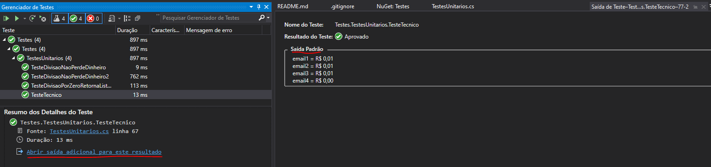

## Dependências:

- Visual Studio 16.8.3
- .Net 5.0

## Modo de uso:

1. Compile a solução (Ctrl + Shift + B)
2. Rode os testes, para o teste **'TesteTecnico'** 
	você pode se interessar em ver os resultados impressos em tela, 
	para isso use o gerenciador de testes do Visual Studio (vide imagem).

